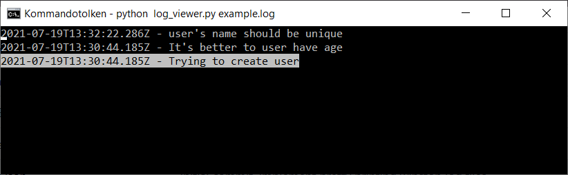
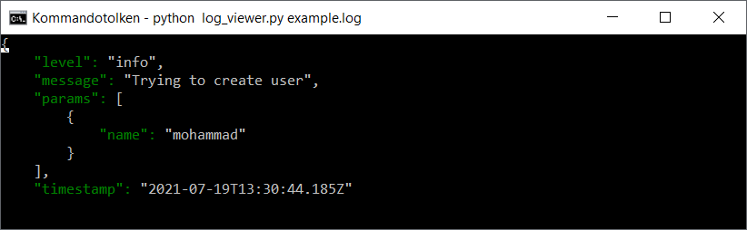

# Json Log Viewer

## Overview

Json Log Viewer is a Python-based command-line tool designed for efficient viewing and real-time monitoring of JSON-formatted log files. It's particularly useful for logs generated by libraries like Winston but is flexible enough to accommodate various JSON log formats.

## Features

- **Interactive Viewing**: Navigate through log events using keyboard controls.
- **Detail View**: Inspect detailed information of each log event in pretty-printed JSON.
- **Real-Time Monitoring**: Tail mode for viewing log events as they are generated.
- **Reverse Order Display**: Shows the most recent log events first.
- **Log Format Flexibility**: Works well with any JSON log format, expecting at least `timestamp` and `message` fields.

## Example Log Format

```json
{
  "timestamp": "2021-07-01T12:34:56.789Z",
  "message": "Example log message",
  ... // Other fields
}
```

## Requirements

- Python 3.x
- `curses` library (`windows-curses` for Windows)

## Installation

1. Ensure Python 3.x is installed on your system.
2. Clone or download the Json Log Viewer repository to your local machine.
3. Install required dependencies:
   ```bash
   pip install windows-curses  # For Windows users
   ```

## Usage

Run the script with the path to your log file:

```bash
python log_viewer.py /path/to/logfile.log
```

For real-time log updates:

```bash
python log_viewer.py /path/to/logfile.log --tail
```

### Navigation Keys

- **Up/Down Arrows or 'w'/'s'**: Move through log events.
- **Page Up/Page Down**: Scroll faster through log events.
- **'d' Key**: Display detailed information of the selected log event.
- **'q' Key**: Quit the viewer.

### Examples
See an example log file in examples/example.log.

Here's an example of viewing a log file:


Here's an example of the details view:


## Contributing

Contributions to Json Log Viewer are welcome. Please submit pull requests or open issues to suggest improvements or report bugs.

## License

Json Log Viewer is released under the MIT License.